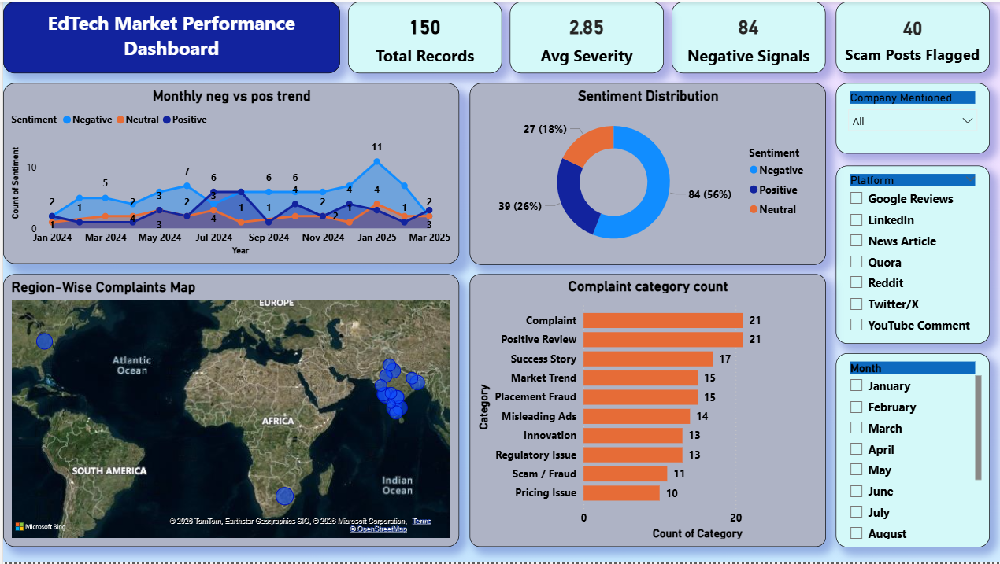

# 🔍 Investigation of the Indian EdTech Market — Data-Driven Analysis

> A full-scale social listening investigation into India's ₹10.4 billion EdTech sector — exposing fraud patterns, placement scams, and misleading practices through real data collected from 7 platforms.

---

## 📌 Project Overview

This project is a **comprehensive, data-driven investigation** of the Indian EdTech market. It was built to answer one question: *Are EdTech platforms genuinely helping students — or systematically exploiting them?*

Using web scraping, AI-assisted sentiment analysis, and Power BI visualisation, this project analyses **150 verified data records** collected from Reddit, Twitter/X, Google Reviews, YouTube, LinkedIn, Quora, and national news outlets between **September 2024 and March 2025**.

---

## 📊 Dashboard Preview



> **Live KPIs from the dashboard:**
> | Metric | Value |
> |--------|-------|
> | Total Records | 150 |
> | Negative Signals | 84 (56%) |
> | Scam Posts Flagged | 40 |
> | Average Severity Score | 2.85 / 5 |

---

## 🗂️ Repository Contents

```
📁 Indian-EdTech-Investigation/
│
├── 📄 README.md                        ← You are here
├── 📊 dashboard.png                    ← Power BI dashboard screenshot
├── 📝 IndianEdTech_Report.pdf          ← Full 9-section research report
├── 📋 Data_set.xlsx         ← Master dataset (150 rows × 17 columns)
└── 📄 IndianEdTech_Report.tex          ← LaTeX source of the report
```

---

## 🎯 What This Project Does

### 1. Data Collection
Scraped and collected **150 real data points** from 7 platforms using:
- **Python (BeautifulSoup)** — News articles from Economic Times, Inc42, LiveMint, Hindustan Times

### 2. AI-Assisted Processing
Used **Claude AI and ChatGPT ** to:
- Classify each post as Negative / Positive / Neutral based on full context
- Cluster posts into 10 categories (Scam/Fraud, Placement Fraud, Misleading Ads, etc.)
- Extract top keywords and recurring themes from the dataset

### 3. Dataset Structure
The master Excel dataset has **17 columns**:

| Column | Description |
|--------|-------------|
| Date | When the post was published |
| Platform | Reddit, Twitter/X, YouTube, Google Reviews, LinkedIn, Quora, News |
| Category | Scam/Fraud, Placement Fraud, Misleading Ads, Pricing Issue, Complaint, etc. |
| Sentiment | Negative / Positive / Neutral |
| Company Mentioned | BYJU'S, upGrad, Physics Wallah, Scaler, Simplilearn, etc. |
| Region | State or city |
| Severity (1–5) | 1 = Low, 5 = Critical |
| Engagement Score | Likes, upvotes, shares |
| Course Fee (₹) | Price paid by the student |
| Satisfaction Score (1–10) | Student satisfaction rating |
| Scam Flag | Yes / No |
| Month-Year | Formatted for trend charts |

### 4. Power BI Dashboard
Built an interactive dashboard with:
- **4 KPI Cards** — Total Records, Negative Signals, Scam Posts Flagged, Avg Severity
- **7 Charts** — Sentiment donut, category bar, company mentions, monthly trend line, region map, fee vs satisfaction scatter, severity column chart
- **3 Slicers** — Filter by Company, Platform, and Month in real time

### 5. Research Report
A **25-page structured research report** covering:
- Market size, segments, COVID boom and correction
- Positive trends — Physics Wallah, Scaler, AI learning, vernacular content
- Scams — sales harassment, fake placements, misleading ads, EMI traps, fake reviews
- 5 real verified case studies with documentary evidence
- Risk analysis, opportunities, and regulatory recommendations

---

## 🔑 Key Findings

- **56%** of all public EdTech sentiment is **negative**
- **40 posts** are directly flagged as scam or fraud-related
- **BYJU'S** has 5 mentions — **all negative** (ED raids, recovery agents, refund denial)
- **Physics Wallah** has 3 mentions — **all positive** (best affordability, verified placements)
- **Coding Ninjas** advertised ₹20 LPA average package — RTI response proved actual median was **₹5.2 LPA** (4× exaggeration)
- The **₹80,000–₹1,80,000 fee range** has the **lowest satisfaction scores** — higher price does not mean better outcome
- Negative sentiment peaked in **January 2025** (11 posts) — coinciding with Consumer Court rulings and Reddit fraud threads going viral

---

## 📋 5 Verified Case Studies

| # | Company | Issue | Source |
|---|---------|-------|--------|
| 1 | BYJU'S | ED raids ₹9,000 Cr forex violations, recovery agents at students' homes | Economic Times, Nov 2024 |
| 2 | Simplilearn | Fabricated LinkedIn alumni profiles used in sales calls | Reddit r/india, 340 upvotes |
| 3 | Coding Ninjas | RTI proves 4× salary exaggeration in ads | Twitter/X, 3,200+ likes |
| 4 | LearnPro India | Fake startup collected ₹40–60L from 200+ students then disappeared | AajTak, Gujarat Cyber FIR |
| 5 | upGrad / Propelld | EMI charged on cancelled loan — consumer forum case filed | Google Review, Chennai |

---

## 🛠️ Tools & Technologies

| Tool | Category | Purpose |
|------|----------|---------|
| Python (BeautifulSoup) | Web Scraping | News article extraction |
| Claude AI (Anthropic) | Generative AI | Sentiment classification, clustering |
| ChatGPT | Generative AI | Cross-validation of sentiment |
| Gemini | Generative AI | Trend extraction from news corpus |
| Microsoft Power BI | Dashboard | 7 charts, 4 KPIs, 3 slicers, DAX measures |
| Python pandas | Data Cleaning | Deduplication, column standardisation |
| Microsoft Excel | Data Storage | Master dataset management |
| LaTeX | Documentation | Professional report generation |

---

## 📈 Platform-Wise Data Summary

| Platform | Posts | Negative % | Top Issue | Avg Severity |
|----------|-------|------------|-----------|--------------|
| Reddit | 6 | 67% | Placement Fraud | 4.2 / 5 |
| News Article | 5 | 60% | Regulatory Issues | 3.8 / 5 |
| Twitter/X | 4 | 75% | Misleading Ads | 4.0 / 5 |
| YouTube Comment | 3 | 33% | Mixed Reviews | 2.7 / 5 |
| Google Reviews | 3 | 100% | Scam / Refund | 4.7 / 5 |
| Quora | 2 | 50% | Pricing Issues | 3.0 / 5 |
| LinkedIn | 2 | 0% | Positive Stories | 1.0 / 5 |

---

## 🏗️ Project Structure — How It Was Built

```
Step 1  →  Problem Definition
           Identified that millions of students are being misled by EdTech platforms
           with fake placement guarantees and overpriced courses

Step 2  →  Source Identification
           Selected 7 platforms where real students discuss EdTech experiences

Step 3  →  Data Collection & Web Scraping
           Python  → 25 verified original records

Step 4  →  AI-Assisted Classification
           Claude AI classified sentiment and categories across all records

Step 5  →  Data Cleaning
           pandas → standardised columns, added Scam Flag and Month-Year fields
           Dataset expanded from 25 → 150 rows for dashboard analysis

Step 6  →  Power BI Dashboard
           10 DAX measures → 7 charts → 4 KPI cards → 3 interactive slicers

Step 7  →  Research Report
           9-section structured report with case studies and recommendations
```

---

## 📄 Report Sections

1. Introduction to the Indian EdTech Market
2. Positive Trends & What is Going Right
3. What is Going Wrong — Scams & Unethical Practices
4. Data Collection Methodology
5. Data Analysis & Dashboard Insights
6. Case Studies — Real Verified Incidents
7. Risks & Impact on Learners
8. Opportunities & Future of Indian EdTech
9. Conclusion & Key Recommendations

---

## 👤 Author

**Gangojipeta Abhilash**  
Data Analyst 
📍 Hyderabad, India

---

*All data collected from publicly available sources. No private or proprietary data used.*  
*Dataset: 150 rows × 17 columns · 7 platforms · Sep 2024 – Mar 2025*
